# XAI for PyTorch

`pip install grad-cam`


This is a package with state of the art methods for Explainable AI for computer vision.
This can be used for diagnosing model predictions, either in production or while
developing models.
The aim is also to serve as a benchmark of algorithms and metrics for research of new explainability methods.

⭐ Comprehensive collection of Pixel Attribution methods for Computer Vision.

⭐ Tested on many Common CNN Networks and Vision Transformers.

⭐ Advanced use cases: Works with Classification, Object Detection, Semantic Segmentation, Embedding-similarity and more.

⭐ Includes smoothing methods to make the CAMs look nice.

⭐ High performance: full support for batches of images in all methods.

⭐ Includes metrics for checking if you can trust the explanations, and tuning them for best performance.


| Method              | What it does                                                                                                                |
|---------------------|-----------------------------------------------------------------------------------------------------------------------------|
| GradCAM             | Weight the 2D activations by the average gradient                                                                           |
| HiResCAM            | Like GradCAM but element-wise multiply the activations with the gradients; provably guaranteed faithfulness for certain models |
| GradCAMElementWise  | Like GradCAM but element-wise multiply the activations with the gradients then apply a ReLU operation before summing        |
| GradCAM++           | Like GradCAM but uses second order gradients                                                                                |
| XGradCAM            | Like GradCAM but scale the gradients by the normalized activations                                                          |
| AblationCAM         | Zero out activations and measure how the output drops (this repository includes a fast batched implementation)              |
| ScoreCAM            | Perbutate the image by the scaled activations and measure how the output drops                                              |
| EigenCAM            | Takes the first principle component of the 2D Activations (no class discrimination, but seems to give great results)        |
| EigenGradCAM        | Like EigenCAM but with class discrimination: First principle component of Activations*Grad. Looks like GradCAM, but cleaner |
| LayerCAM            | Spatially weight the activations by positive gradients. Works better especially in lower layers                             |
| FullGrad            | Computes the gradients of the biases from all over the network, and then sums them                                          |
| Deep Feature Factorizations           | Non Negative Matrix Factorization on the 2D activations                                                 |

## Visual Examples

| What makes the network think the image label is 'pug, pug-dog' | What makes the network think the image label is 'tabby, tabby cat' | Combining Grad-CAM with Guided Backpropagation for the 'pug, pug-dog' class |
| ---------------------------------------------------------------|--------------------|-----------------------------------------------------------------------------|
  |  |  |

## Object Detection and Semantic Segmentation
| Object Detection | Semantic Segmentation |
| -----------------|-----------------------|
| 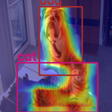 | 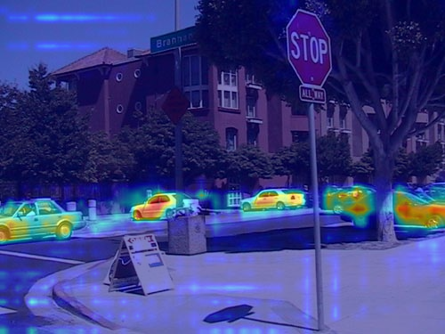 |

## Explaining similarity to other images / embeddings
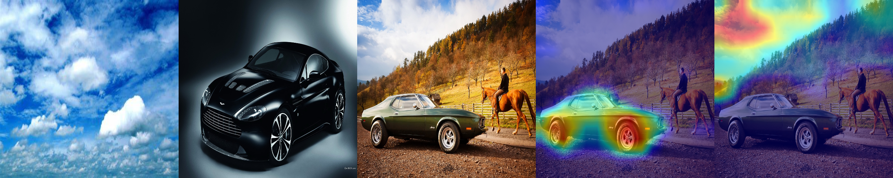

## Deep Feature Factorization
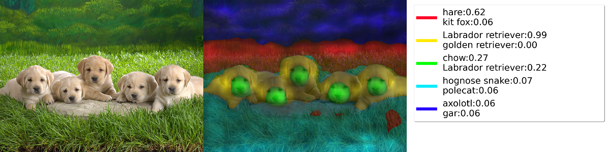
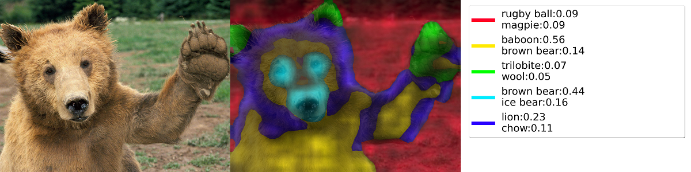

## Classification

#### Resnet50:
| Category  | Image | GradCAM  |  AblationCAM |  ScoreCAM |
| ---------|-------|----------|------------|------------|
| Dog    |  |      |  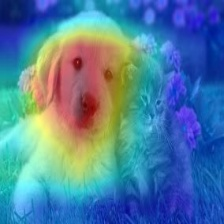   |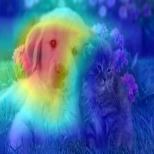   |
| Cat    |  |      |     |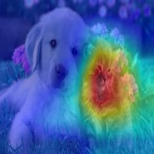   |

#### Vision Transfomer (Deit Tiny):
| Category  | Image | GradCAM  |  AblationCAM |  ScoreCAM |
| ---------|-------|----------|------------|------------|
| Dog    |  | 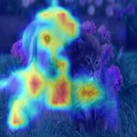     |  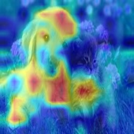   |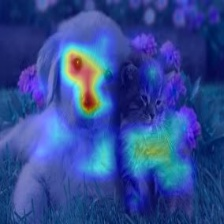   |
| Cat    |  | 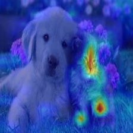     |  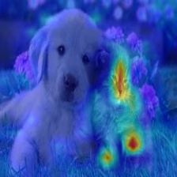   |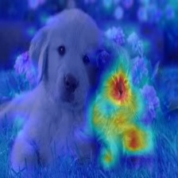   |

#### Swin Transfomer (Tiny window:7 patch:4 input-size:224):
| Category  | Image | GradCAM  |  AblationCAM |  ScoreCAM |
| ---------|-------|----------|------------|------------|
| Dog    |  | 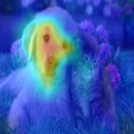     |  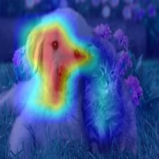   |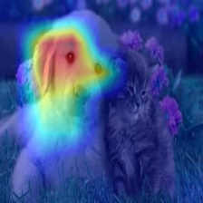   |
| Cat    |  | 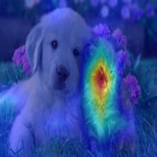     |  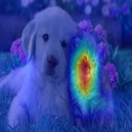   |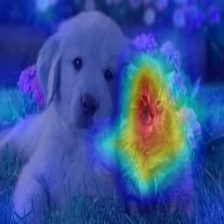   |


# Metrics and Evaluation for XAI

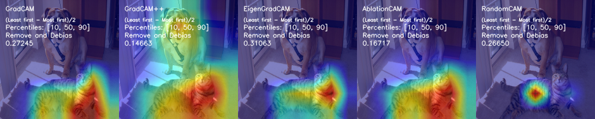
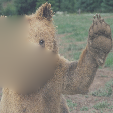


----------
# Choosing the Target Layer
You need to choose the target layer to compute CAM for.
Some common choices are:
- FasterRCNN: model.backbone
- Resnet18 and 50: model.layer4[-1]
- VGG and densenet161: model.features[-1]
- mnasnet1_0: model.layers[-1]
- ViT: model.blocks[-1].norm1
- SwinT: model.layers[-1].blocks[-1].norm1

If you pass a list with several layers, the CAM will be averaged accross them.
This can be useful if you're not sure what layer will perform best.

----------

# Using from code as a library

```python
from pytorch_grad_cam import GradCAM, HiResCAM, ScoreCAM, GradCAMPlusPlus, AblationCAM, XGradCAM, EigenCAM, FullGrad
from pytorch_grad_cam.utils.model_targets import ClassifierOutputTarget
from pytorch_grad_cam.utils.image import show_cam_on_image
from torchvision.models import resnet50

model = resnet50(pretrained=True)
target_layers = [model.layer4[-1]]
input_tensor = # Create an input tensor image for your model..
# Note: input_tensor can be a batch tensor with several images!

# Construct the CAM object once, and then re-use it on many images:
cam = GradCAM(model=model, target_layers=target_layers)

# You can also use it within a with statement, to make sure it is freed,
# In case you need to re-create it inside an outer loop:
# with GradCAM(model=model, target_layers=target_layers) as cam:
#   ...

# We have to specify the target we want to generate
# the Class Activation Maps for.
# If targets is None, the highest scoring category
# will be used for every image in the batch.
# Here we use ClassifierOutputTarget, but you can define your own custom targets
# That are, for example, combinations of categories, or specific outputs in a non standard model.

targets = [ClassifierOutputTarget(281)]

# You can also pass aug_smooth=True and eigen_smooth=True, to apply smoothing.
grayscale_cam = cam(input_tensor=input_tensor, targets=targets)

# In this example grayscale_cam has only one image in the batch:
grayscale_cam = grayscale_cam[0, :]
visualization = show_cam_on_image(rgb_img, grayscale_cam, use_rgb=True)

# You can also get the model outputs without having to re-inference
model_outputs = cam.outputs
```

----------

# Metrics and evaluating the explanations

```python
from pytorch_grad_cam.utils.model_targets import ClassifierOutputSoftmaxTarget
from pytorch_grad_cam.metrics.cam_mult_image import CamMultImageConfidenceChange
# Create the metric target, often the confidence drop in a score of some category
metric_target = ClassifierOutputSoftmaxTarget(281)
scores, batch_visualizations = CamMultImageConfidenceChange()(input_tensor, 
  inverse_cams, targets, model, return_visualization=True)
visualization = deprocess_image(batch_visualizations[0, :])

# State of the art metric: Remove and Debias
from pytorch_grad_cam.metrics.road import ROADMostRelevantFirst, ROADLeastRelevantFirst
cam_metric = ROADMostRelevantFirst(percentile=75)
scores, perturbation_visualizations = cam_metric(input_tensor, 
  grayscale_cams, targets, model, return_visualization=True)

# You can also average accross different percentiles, and combine
# (LeastRelevantFirst - MostRelevantFirst) / 2
from pytorch_grad_cam.metrics.road import ROADMostRelevantFirstAverage,
                                          ROADLeastRelevantFirstAverage,
                                          ROADCombined
cam_metric = ROADCombined(percentiles=[20, 40, 60, 80])
scores = cam_metric(input_tensor, grayscale_cams, targets, model)
```
----------


